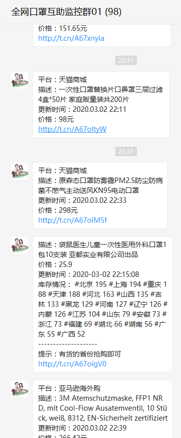
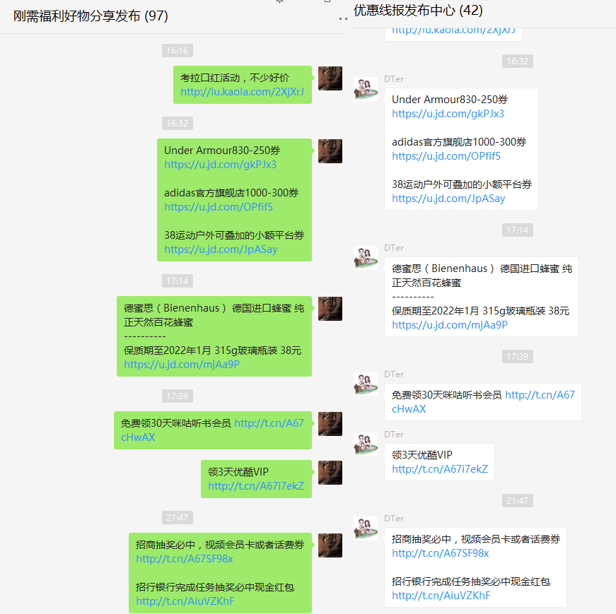

[](https://github.com/chatie/wechaty)

[](http://nodejs.cn/download/)
[](https://github.com/Chatie/wechaty)


<!-- START doctoc generated TOC please keep comment here to allow auto update -->
<!-- DON'T EDIT THIS SECTION, INSTEAD RE-RUN doctoc TO UPDATE -->
**Table of Contents**  *generated with [DocToc](https://github.com/thlorenz/doctoc)*


## 淘客小助手1.0

让闲置的微信，成为你的淘客小帮手

群消息活跃，多群信息管理，自动监听同行发单，群维护，群口罩货源监控等

## 部分效果预览（功能持续完善中）



口罩群实时监控



群消息监控，转发，设置条件转发到多个群

## 安装

### 1、安装依赖
```
 npm init -y
 npm install wechaty@next
 npm install wechaty-puppet-padplus@latest
 npm install qrcode-terminal
 npm install pm2
```

### 2、配置token和要监控的群

拉取项目前，国内用户请配置好npm的淘宝源，**(很重要，防止下载chromium失败，因为下载文件在150M左右，请耐心等待)**
* 在src目录下存在一个`dtbot.js`文件

```
const token = 'your wechaty token';
```
* 在src/utils目录下存在一个`checker.js`文件

```
var config = {
    //要监听的羊毛群
    'LISTEN_YANGMAO_ROOMS': [
        '刚需福利好物分享发布',
        '羊毛监听测试',
    ],
    //监听到羊毛消息，转发到这个群
    'TARGET_YANGMAO_ROOMS': [
        '优惠线报发布中心',
        // '全网口罩互助监控群01',
    ],
    //监听到口罩信息，转发到这个群
    'TARGET_MASK_ROOMS': [
        // '抖兔',
        '全网口罩互助监控群01',
    ],
    //监听退出进入的群
    'LEAVE_JOIN_ROOMS': [
        '羊毛监听测试',
        '全网口罩互助监控群01',
    ]
}
```
### 3、服务器接口配置
关于口罩库存消息接口，需要自己完善

### 4、启动项目

```
本地启动： node dtbot.js
服务器启动：pm2 start dtbot.js
```


### 5. 更多问题
关于wechaty的相关接口，请
[参考wechaty官网文档](https://docs.chatie.io/v/zh/)，如果以上还没有解决你的问题，请先往wechaty的项目[issues](https://github.com/Chatie/wechaty/issues)中查找是否存在相同的问题，由于本项目是依赖wechaty开发，所以启动时遇到的问题大部分是wechaty的。


## 注意

 本项目属于个人开发，为淘客日常活跃群气氛的小助手，你可以在此基础上新增你需要的有趣的功能
 
 ## 体验与技术交流
 
 欢迎有兴趣的小伙伴可以微信关注“抖兔工具箱”，回复`“口罩”`进入进群
 如果对技术交流有兴趣，欢迎联系我

 

 ### 淘客小助手功能
| 功能        | 触发事件  |    例子   |  说明   |
| ------------| ---------|---------- |------- |
| 群欢迎 |某人加入指定群聊 |欢迎xx加入 | 完成|
| 口罩货源监控 |定时消息 |自动群发到指定的群 | 完成|
| 消息转发 |监控主群消息，转发到副群 |一次发布，多群转发 | 完成|
| 消息转链 |监控某个群的某个人 |自动转链到自己的pid |部分完成|
| 清晨问候 |每天早上定时打招呼 |清晨寄语，群人数变化等 | 待完成|
| 群相册 |群里所有人的头像，生成相册 | 个性化功能|待完成|
| 自动踢人 |有人发广告 |监控发广告的人，自动踢出 | 待完成|

更多功能正在规划和添加中...
